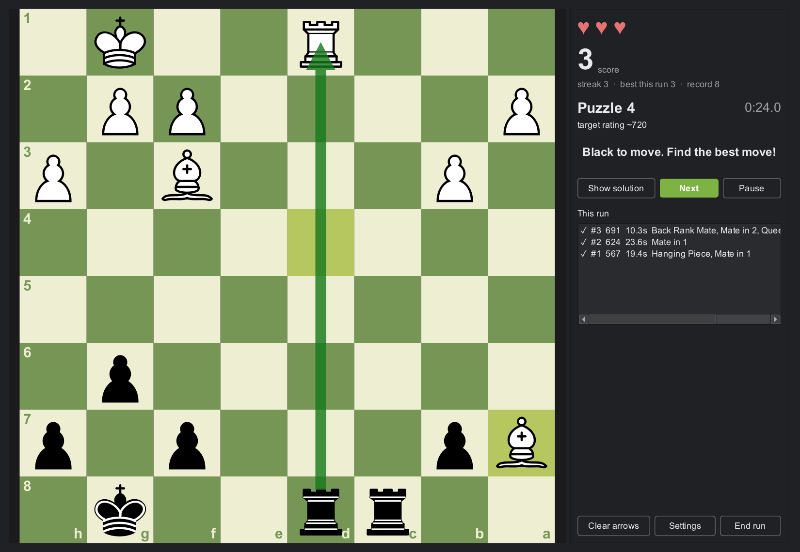
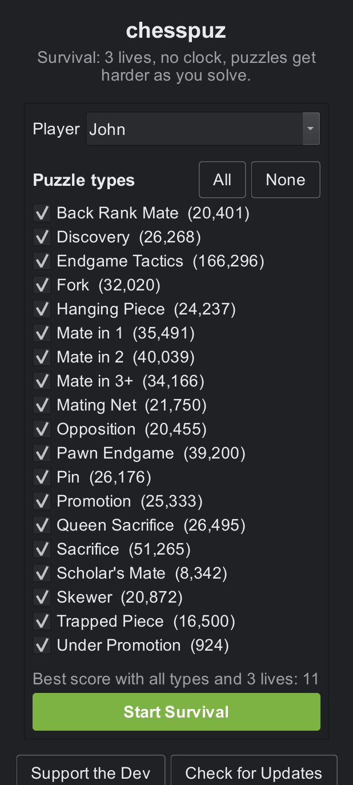
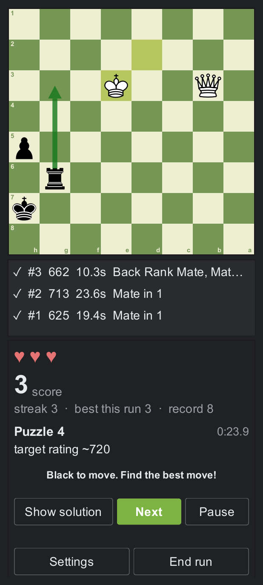
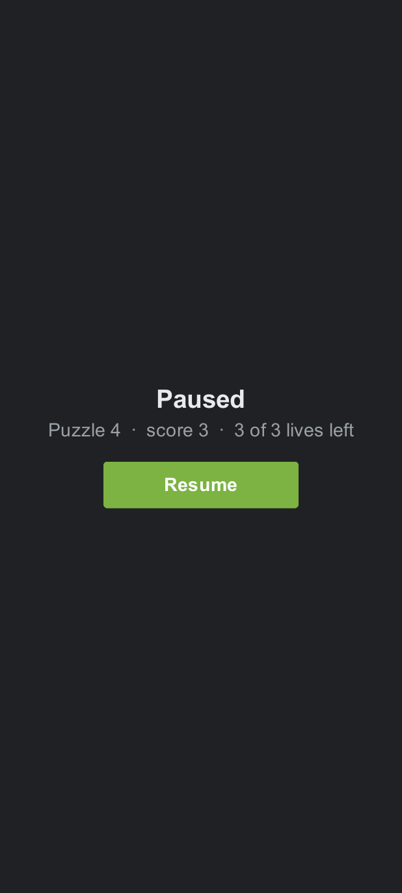

# chesspuz

A dark-mode chess puzzle trainer for Windows and Android with a chess.com-style Survival mode: three lives (1-10 in Settings), no clock, puzzles get harder the more you solve. Review every puzzle of a run move by move, explore alternatives, draw arrows and highlights, and compare runs on local leaderboards. Puzzles come from the free Lichess puzzle database, imported once into a local SQLite file and filtered by the 19 chess.com puzzle types.

First run: `python main.py import --download` (one-time, about 300 MB) builds the puzzle database in `%LOCALAPPDATA%/chesspuz`, or press "Rebuild puzzle database" in Settings.

## Screenshots

Review, leaderboard, stats, mistakes and settings on both shapes: [docs/screenshots](docs/screenshots).

## How to play
- Home: pick a player name and the puzzle types, then Start Survival. Puzzles begin around rating 600 and climb 40 points per solved puzzle (adjustable in Settings). End run keeps the score.
- Mistakes: the first wrong move on a puzzle costs a life, but the puzzle stays on the board. Keep trying, press Show solution to see the line (or, with "One move at a time" chosen in Settings > Difficulty, to see just the next move and find the rest yourself; each press shows one more), or Next to move on. Losing every life (three by default, 1-10 in Settings) ends the run after the current puzzle. Every puzzle you got wrong lands on the Mistakes page, where Practise replays them with no lives or score until they are fixed.
- Pause: press Pause while solving. The clock stops and the whole page is covered until you press Resume (or Back on the phone); the pause does not count in the puzzle's time.
- Leaderboard and Stats have a Lives filter (preset to your setting). A run played with more lives also counts on the boards for fewer lives, with the score it had when it lost that many: a 3-life run stands on the 1-life board with its score before the first mistake. History always shows final scores.
- Sounds: clicks, piece moves, captures and a chime or buzz for right and wrong. Settings has Mute all and a volume slider per sound.
- Settings (also reachable from a run): lives per run, board and piece colours with a preview, text size, animation speed, the difficulty ramp, Export and Import profile, Clear stats per player, the Stockfish path and the database rebuild.
- Profiles: Export profile in Settings writes the runs, stats and settings of one player (or everyone) to a JSON file you keep anywhere: a cloud drive, the phone's Download folder, a new machine. Import profile merges such a file back: players are matched by name, runs already present are skipped, so a file can be imported twice or into a friend's app without damage. Settings come back only into an app nobody has used yet.
- Timer: the time on the current puzzle is shown for information only; each puzzle's time appears in the run overview, in Review and on the Played page.
- Played: every attempt you made. Double-click any puzzle there, on Mistakes, or in the run overview to play it again in its own window (Show solution, Try again). The first attempt in a window counts as practice.
- Board: click-click or drag to move, drop the king on its rook to castle, pick the piece when a pawn promotes. A drag only starts after the pointer has clearly moved, so a wobbly click stays a click; Settings > Board can turn dragging off altogether (click the piece, then its target). Right-drag draws an arrow, right-click highlights a square (Shift/Ctrl/Alt change the colour), any left click clears them.
- Review: after a run (or from the Leaderboard and History) step through every puzzle, compare your moves with the solution, and play any move to explore; Back to the line returns.
- Engine (optional): download Stockfish from https://stockfishchess.org, unzip it, and set the executable path in Settings to see the evaluation and best move while exploring in Review.
- Support the Dev and Check for Updates, above the menu on the home page, open https://buymeacoffee.com/carter.bnw and the Releases page in your browser. The status line at the bottom of the home page shows the version you are running.

## Install (Windows)
- Download `chesspuz-<version>-windows.zip` from the [Releases page](https://github.com/CARTER-BNW/chesspuz/releases), unzip it anywhere and run `chesspuz.exe`.
- First start: open Settings and press "Rebuild puzzle database" (downloads the Lichess puzzle file, about 300 MB, once). Puzzles and your results live in `%LOCALAPPDATA%\chesspuz`.
- Optional: download Stockfish from https://stockfishchess.org and set its path in Settings for engine analysis in Review.

## Your data across updates
- Windows: runs, players and settings live in `%LOCALAPPDATA%\chesspuz\user.sqlite`, outside the app folder. Unzip a new version over the old one, or anywhere else, and everything is still there. Export profile in Settings gives you a file to keep as well.
- Android: install the new APK over the old one and the data stays (the releases are signed with the same key). Uninstalling the app wipes its private folder, so after every run the app also writes a copy of every profile to `Download/chesspuz/chesspuz-profiles.json` on the phone; after a reinstall, Settings > Import profile brings it back. Export profile lets you pick any location, Google Drive included.
- Moving to a new machine or phone: Export profile on the old one, Import profile on the new one.

## Build a release yourself
- `python -m pip install -r requirements.txt -r requirements-dev.txt pyinstaller`
- `build_release.bat` builds `dist\chesspuz\chesspuz.exe` and `dist\chesspuz-<version>-windows.zip` (icon from `tools\make_icon.py`, spec in `chesspuz.spec`).

## Android
The same app runs on a phone (portrait: board above a scrolling panel; finger scrolling; the
Back key steps back instead of quitting; sounds through Android's AAudio; the puzzle database
travels inside the APK). Install: download `chesspuz-<version>-arm64-v8a-release.apk` from the
[Releases page](https://github.com/CARTER-BNW/chesspuz/releases) onto the phone and open it
(allow installs from that source when asked). Install a
newer APK the same way, over the old one: runs and settings stay. In Review the puzzle list sits
between the board and the panel and scrolls on its own.
`python android\sync.py all` syncs the code, builds the signed APK in the WSL box and installs
it over USB; the pipeline, the toolchain and the phone controls are in
[android/README.md](android/README.md), the design in [docs/specs/android.md](docs/specs/android.md).
`python android\app\main.py --desktop` shows the phone layout in a window on the PC.

## Commands
- Run: double-click `run.bat` (or `python main.py`; `run.bat --console` shows errors). The bat uses the repository's `.venv` when there is one, else the python on PATH, and says so if the packages are missing.
- Test: `python -m pytest -q`
- Lint + format: `ruff check . && ruff format .`
- Install deps: `python -m pip install -r requirements.txt -r requirements-dev.txt`
- Use `python` (not `python3`); Python 3.13 on this machine. Optional venv: `python -m venv .venv` then `.venv\Scripts\activate`

## Project docs
- Where things are right now: [docs/STATUS.md](docs/STATUS.md)
- Phases and checklists: [docs/PLAN.md](docs/PLAN.md)
- Feature specs: [docs/specs/](docs/specs/)
- Instructions Claude reads every session: [CLAUDE.md](CLAUDE.md)

Created 2026-09-22 from the `python` template in `D:\Dev\_templates`.

## Licence
GPL-3.0-or-later (see LICENSE). Puzzles come from the Lichess puzzle database (CC0); piece images are the Colin Burnett set bundled with python-chess (GPL/BSD/GFDL).
